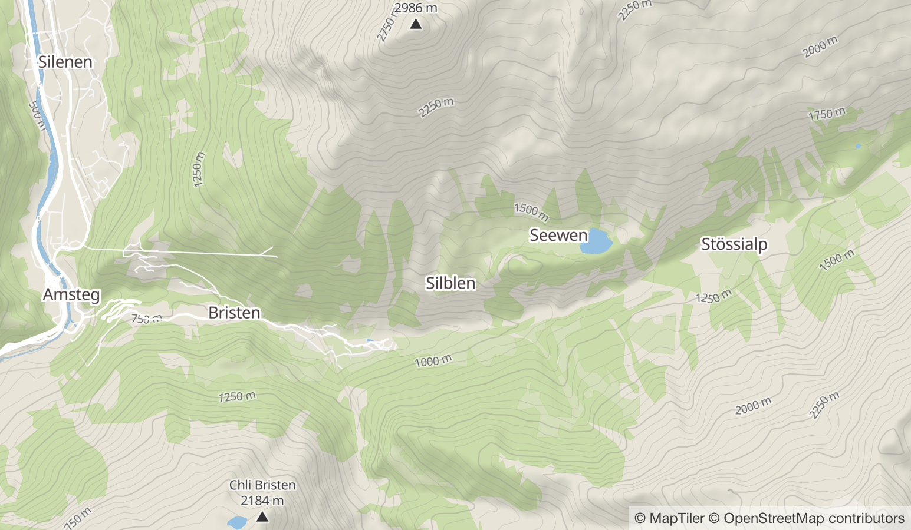

# Open Source Map Styles
OpenMapTiles comes with a variety of different styles optimized for the [OpenMapTiles vector tile schema](https://openmaptiles.org/schema). The styles and schema are free and open-source and you can adapt the design and code for your project or commercial product however you like, if you keep the copyright attributtion. You can either use the styles directly as basemap or as starting point for your own map style.

# GL Styles
Our map styles are written in the [Mapbox GL style specification](https://openmaptiles.org/docs/style/mapbox-gl-style-spec) and you can [edit them using Maputnik](https://openmaptiles.org/docs/style/maputnik).
The same style can be used in client based maps with [MapLibre GL JS](https://openmaptiles.org/docs/website/maplibre-gl-js/) or [OpenLayers](https://openmaptiles.org/docs/website/openlayers/), on native [Android/iOS mobile apps](https://openmaptiles.org/mobile/), and in raster maps for print and older clients like Leaflet thanks to [Tileserver GL](https://openmaptiles.org/docs/host/tileserver-gl/).

## 1.MapTiler Basic
MapTiler Basic is basemap which tries to stay in the background and only give the most relevant information.

## 2. OSM Bright
OSM Bright is a general purpose base map showcasing the great detail of OpenStreetMap data. It is a good starting point for your own complex base maps.

## 3. Positron
Positron is beautiful light base map which is ideal for a non obtrusive basemap for your data visualizations. The cartography by Stamen Design is licensed under CC0. 

## 4. Dark Matter
Dark Matter is a dark base map and a good starting point for other darker designs. The cartography by Stamen Design is licensed under CC0. 

## 5. MapTiler 3D
A Map showcasing 3D buildings. 

## 6. MapTiler Terrain
A basic map style showing the contour lines and hillshading from OpenMapTiles.com.

## 7. Fiord Color
A blue basemap for visualizations.

## 8. Toner
Port of the Stamen Maps Toner style.

## 9. OSM Liberty
A free Mapbox GL basemap style for everyone with complete liberty to use and self host. OSM Liberty is a fork of OSM Bright based on free data sources with a mission for a clear good looking design for the everyday user.

# References
[1] https://openmaptiles.org/styles/
