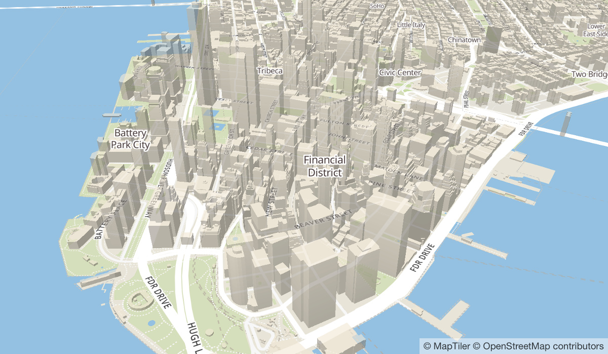

# MapTiler 3D GL Style
A Mapbox GL basemap style featuring 3D buildings using the vector tile
schema of [OpenMapTiles](https://openmaptiles.org).

# Preview

# References
[1] https://github.com/openmaptiles/maptiler-3d-gl-style
