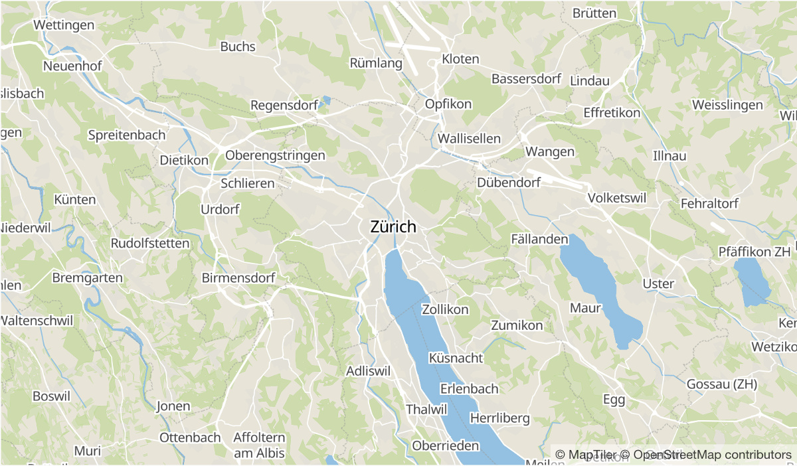

# MapTiler Basic GL Style
A GL basemap style it is using the vector tile
schema of [OpenMapTiles](https://github.com/openmaptiles/openmaptiles).

# Preview

# References
[1] https://github.com/openmaptiles/maptiler-basic-gl-style
