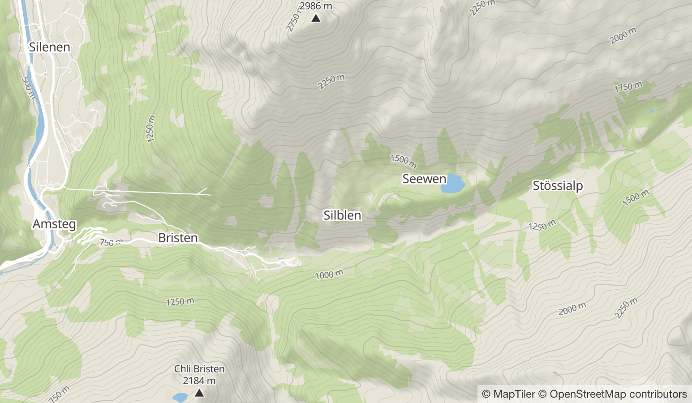

# MapTiler Terrain GL Style
A GL basemap style it is using the vector tile
schema of [OpenMapTiles](https://github.com/openmaptiles/openmaptiles) as well as the contour lines and hillshading from [maptiler.com](https://maptiler.com).

# Preview

# References
[1] https://github.com/openmaptiles/maptiler-terrain-gl-style
