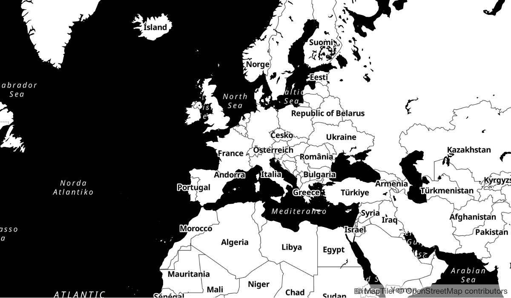

# MapTiler Toner GL Style
This is an adaptation of the [Toner](https://github.com/stamen/toner-carto) map style from [Stamen Maps](http://maps.stamen.com/).

Start at:
- http://maps.stamen.com/toner/
- https://github.com/stamen/mapbox-gl-toner
- https://github.com/stamen/toner-carto

# Preview

# References
[1] https://github.com/openmaptiles/maptiler-toner-gl-style
