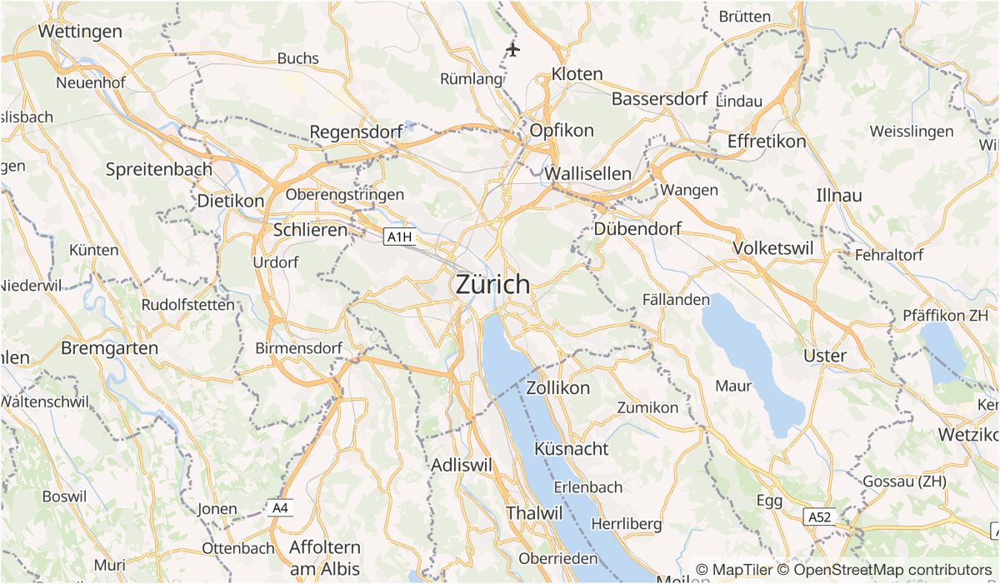

# OSM Bright GL Style
A Mapbox GL basemap style showcasing OpenStreetMap.
It is using the vector tile
schema of [OpenMapTiles](https://github.com/openmaptiles/openmaptiles).

# Preview

# References
[1] https://github.com/openmaptiles/osm-bright-gl-style
