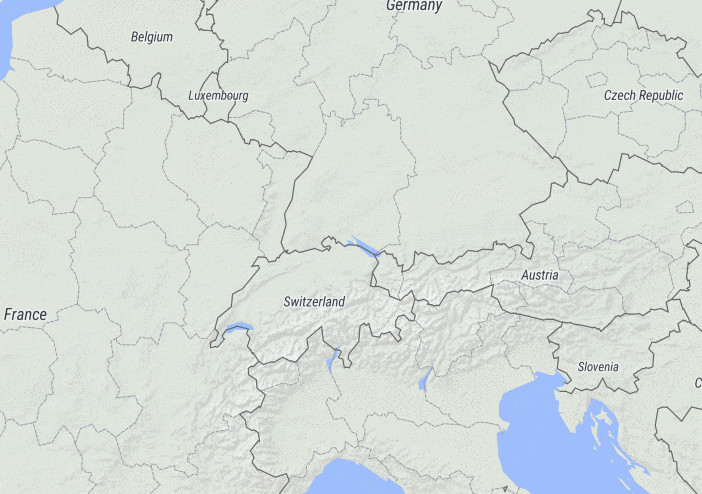

# OSM Liberty GL Style
A free Maplibre and Mapbox GL basemap style for everyone with complete liberty to use and self host. OSM Liberty is a fork of OSM Bright based on free data sources with a mission for a clear good looking design for the everyday user. It is based on the vector tile schema of [OpenMapTiles](https://github.com/openmaptiles/openmaptiles).

**[Preview OSM Liberty with Maputnik](https://maplibre.org/maputnik/?style=https://maputnik.github.io/osm-liberty/style.json)**

# Preview

# References
[1] https://github.com/maputnik/osm-liberty
