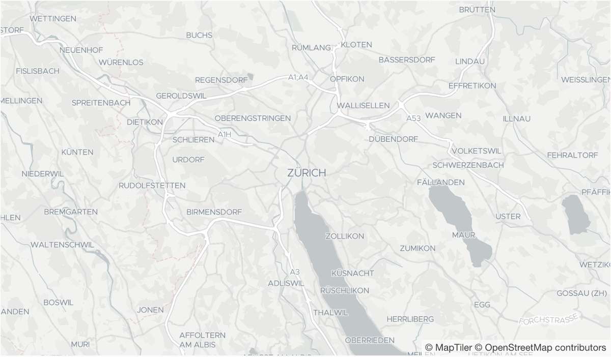

# Positron GL Style
A Mapbox GL basemap style useful for data visualizations. The cartography is based on the
[CartoDB Positron Basemap](https://github.com/CartoDB/CartoDB-basemaps) and it is using the vector tile
schema of [OpenMapTiles](https://github.com/openmaptiles/openmaptiles).

# Preview

# References
[1] https://github.com/openmaptiles/positron-gl-style
